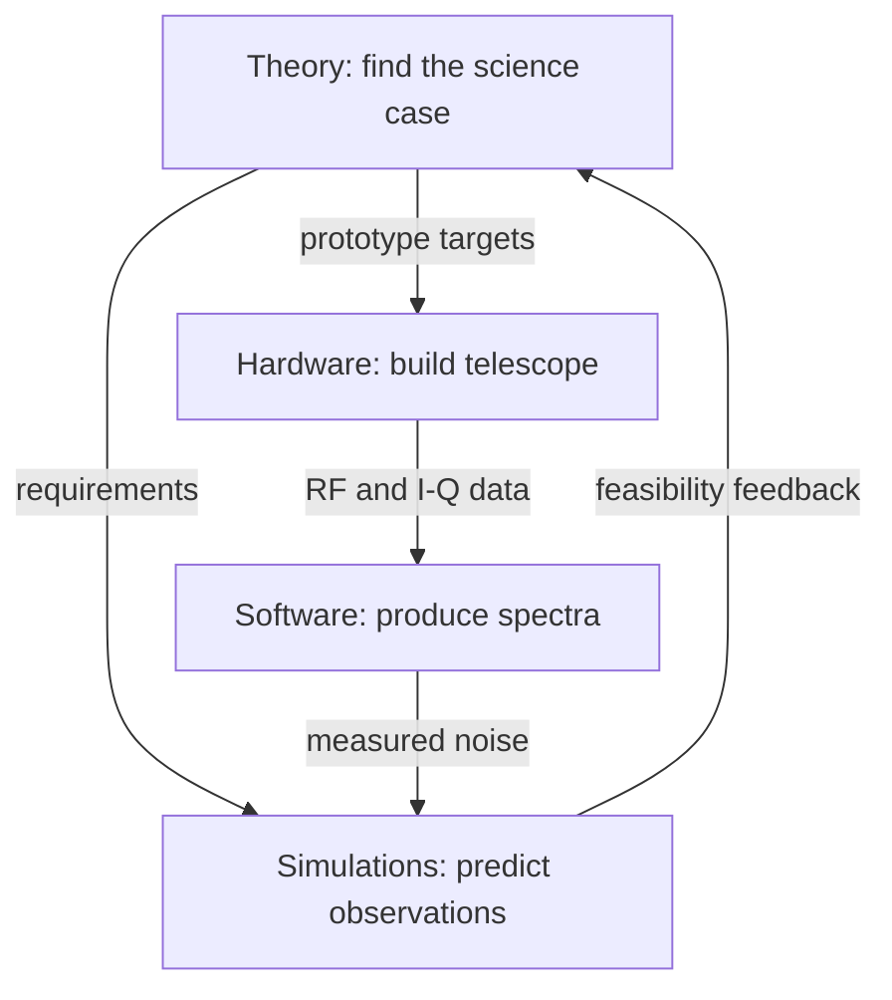

# T-REX

**Time-Resolving Explorer Satellite**

> Find the scientific nail. Build and test the right hammer.

## Goal

| Horizon | Goal |
|---|---|
| **Fall 2026** | Build one 0.7-meter, 1.42 GHz radio telescope and obtain a calibrated first-light spectrum. |
| **Long term** | Determine whether a reconfigurable space-VLBI observatory can uniquely time-resolve black holes, binaries, and transients. |

## Teams

| Team | Owners | Fall deliverable |
|---|---|---|
| [Hardware](Hardware/) | Graham & Chicha | Operational radio telescope |
| [Software](Software/) | Mia & Sharanya | Raw SDR data to calibrated spectrum |
| [Theory](Theory/) | Henry & Neil | Science case, assumptions, and mission trades |
| [Simulations](Simulations/) | Kaylee & Ahaan | End-to-end synthetic observation and reconstructed image |

## Fall 2026

| Month | Hardware | Software | Theory | Simulations |
|---|---|---|---|---|
| **Sep** | Assemble dish, mount, and base | Recover simulated signals | Identify candidate science cases | Select sky models and generate baselines |
| **Oct** | Build and test RF chain | Record and replay PlutoSDR data | Convert science cases into requirements | Simulate beam and interferometric coverage |
| **Nov** | Integrate, point, and calibrate | Automate calibrated spectra | Conduct mission trade studies | Add noise and reconstruct images |
| **Dec** | First light | Publish first-light spectrum | Select the strongest science case | Deliver final predicted images |

## Repository

| Path | Contents |
|---|---|
| [`Hardware/`](Hardware/) | Telescope assembly, RF chain, budget, and verification |
| [`Software/`](Software/) | Signal generation, SDR recording, spectra, and calibration |
| [`Simulations/`](Simulations/) | Baselines, synthetic observations, and reconstructed images |
| [`Theory/`](Theory/) | Science cases, knowns, assumptions, unknowns, and trade studies |

## Workflow

## Working rule

- Start with your team's `README.md`.
- Produce a measurable result each month.
- Treat failed assumptions as useful results.
- Finish the minimum telescope before adding stretch goals.
