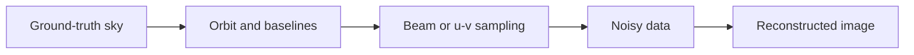

# Simulations

**Owners:** Kaylee & Ahaan

**Goal:** Predict what T-REX would actually observe—not merely its interferometric coverage.

## Observation path

## Path to a predicted image

| Month | Action | Done when... |
|---|---|---|
| **Sep** | Select black-hole, binary, and transient sky models | Inputs and reference configurations are defined |
| **Oct** | Simulate single-dish beam and constellation sampling | Beam-convolved and dirty images are produced |
| **Nov** | Add noise, cadence, and data gaps; reconstruct images | Reconstructions are compared with ground truth |
| **Dec** | Compare configurations | Final image panel recommends a mission configuration |

## Required outputs

- Ground-truth image
- Simulated measurement or dirty image
- Reconstructed image
- Image-fidelity metric
- Configuration recommendation

## Scope rules

- Interferometric coverage is an intermediate result, not the deliverable.
- A single dish uses a beam model, not interferometric coverage.
- Use existing ground-truth images before building a new ray tracer.
