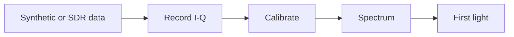

# Software

**Owners:** Mia & Sharanya

**Goal:** Convert simulated and measured SDR data into a calibrated spectrum.

## Data path

## Path to first light

| Month | Action | Done when... |
|---|---|---|
| **Sep** | Generate and recover simulated signals | A known injected frequency is recovered correctly |
| **Oct** | Record and replay PlutoSDR data | The same recording produces the same spectrum |
| **Nov** | Automate capture, calibration, and plotting | One command produces a labeled calibrated spectrum |
| **Dec** | Run the first-light observation | Raw data, metadata, and final spectrum are saved |

## Minimum output

- Timestamped I-Q recording
- Frequency and power calibration
- Labeled spectrum with units
- Reproducible run instructions

> Use synthetic or shielded/coax-injected test signals. Do not transmit near 1.420 GHz.
