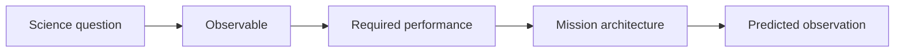

# Theory

**Owners:** Henry Tan & Neil

**Goal:** Find the scientific nail before the team optimizes the hammer.

## Core question

> What observation genuinely requires T-REX, and what must the mission achieve to make that observation?

## Candidate nails

| Science case | Question to answer |
|---|---|
| Time-resolved black-hole imaging | Can T-REX image a source before its structure changes? |
| Binary black holes | Are plausible binaries bright and separated enough to resolve? |
| Rapid transients | Does space VLBI add information beyond a light curve? |
| FRBs and pulsars | Are the proposed bands and collecting area sufficient? |

## Evidence labels

| Label | Meaning |
|---|---|
| **KNOWN** | Supported by a source or verified calculation |
| **ASSUMED** | A provisional input selected by the team |
| **UNKNOWN** | Requires research, simulation, or experiment |
| **DECISION** | A choice made after a trade study |

## Starting register

| Status | Item |
|---|---|
| **KNOWN** | Resolution scales approximately as wavelength divided by baseline |
| **KNOWN** | Imaging cadence also depends on sensitivity, calibration, and coverage |
| **ASSUMED** | 18 one-meter hexagonal DiskSats |
| **ASSUMED** | Candidate bands of 8 and 86 GHz |
| **ASSUMED** | Dispersed and combined observing modes |
| **ASSUMED** | A spiral from Earth toward lunar distances |
| **UNKNOWN** | Strongest unique science case |
| **UNKNOWN** | Target correlated flux at the proposed bands and baselines |
| **UNKNOWN** | Whether combined elements can function as one aperture |
| **UNKNOWN** | Image fidelity before the source changes |
| **UNKNOWN** | Timing, orbit knowledge, storage, and downlink requirements |

## Required trade studies

| Trade | Compare |
|---|---|
| Science | Black holes, binaries, transients, FRBs |
| Frequency | Resolution, source flux, receiver difficulty, and data rate |
| Architecture | Dispersed array, phased cluster, and combined reflector |
| Scale | Fewer large elements versus many small elements |
| Orbit | LEO, elliptical, and cislunar options |
| Data | Raw recording, onboard correlation, and ground correlation |
| Uniqueness | T-REX versus simpler alternatives |

## Fall 2026

| Month | Deliverable |
|---|---|
| **Sep** | Candidate science cases and Known-Assumed-Unknown register |
| **Oct** | Observable and performance requirements for each candidate |
| **Nov** | Highest-value trades tested with Simulations |
| **Dec** | One primary science case, one backup, and explicit kill criteria |

## Definition of done

- One traceable chain: **science → observable → requirement → architecture → predicted image**
- Every major claim labeled as known, assumed, unknown, or decided
- Weak science cases rejected clearly
- “No unique nail found” accepted as a valid result
